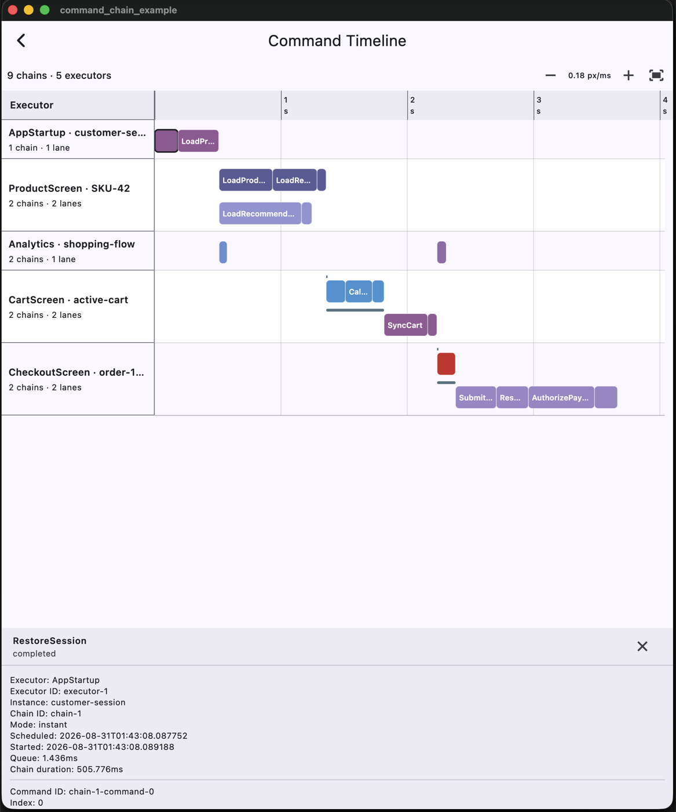

# command_chain_timeline

An interactive Flutter widget for visualizing and analyzing command execution
timelines from `command_chain_logger` snapshots.

It shows what happened inside an application: which commands ran in parallel,
which chains waited in a queue, how long every step took, and where a failure
occurred.



Russian documentation is available in [README.ru.md](README.ru.md).

## Why use it?

The widget is intentionally isolated from the `CommandExecutor` runtime. It
works exclusively with completed immutable snapshots.

This enables offline debugging scenarios:

- **User bug analysis:** a user exports a JSON log after an error. A developer
  opens the file in a local admin panel or developer tool and sees the exact
  sequence that led to the failure.
- **Performance analysis:** the timeline makes bottlenecks in application
  startup and complex business scenarios easier to identify.

## Installation

```shell
flutter pub add command_chain_timeline
```

## Usage

Decode a JSON snapshot exported by the logger and pass it to the widget:

```dart
import 'package:command_chain_logger/command_chain_logger.dart';
import 'package:command_chain_timeline/command_chain_timeline.dart';

final snapshot = CommandLogSnapshot.decode(exportedJson);

CommandChainTimeline(snapshot: snapshot);
```

## Visualization features

- **Executor grouping:** separates command flows by screen or business module,
  such as `AppStartup`, `ProductScreen`, and `CartScreen`.
- **Queues and concurrency:** displays execution lanes, queue intervals, and
  parallel chains.
- **Precise timing:** visualizes the duration of every command on a shared time
  scale.
- **Metadata inspector:** selecting a command opens its chain ID, execution
  mode, start time, description, and `details`.
- **Failure analysis:** highlights failed commands and displays termination
  reasons and failure details.
- **Timeline navigation:** supports zoom and horizontal scrolling for long or
  very fast chains.

## Package boundaries

- **UI only:** the package renders and navigates command timelines. File
  selection, network requests, and the surrounding viewer interface belong to
  the host application. The example supports pasted JSON on every platform and
  `.json` file selection on desktop and web.
- **Snapshot-based:** the widget renders the supplied snapshot and does not
  subscribe to a live logger. Pass a new snapshot when the data changes, for
  example through `setState` or your state manager.

## Roadmap

- Design a dedicated mobile visualization and interaction model. The current
  dense timeline is optimized for larger screens and is not yet suitable for
  comfortable phone use.
